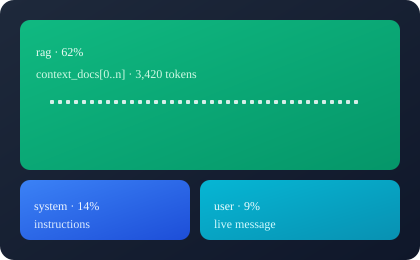

# token-lens

> **Offline token analyzer for LLM prompts.** Classify zones, count tokens,
> score chunk utilization, flag boilerplate, and render self-contained HTML
> treemaps — from a CLI, a Python API, or a local web UI.
> Zero network. Zero CDN. Python stdlib only.

<p align="center">
  
</p>

```
+-----------------------+        +-------------------------+        +----------------------+
|  trace.json           |        |  token-lens             |        |  report.html         |
|  (model + messages    | -----> |  classify + tokenize    | -----> |  - inline SVG        |
|   + tools + RAG docs) |        |  + score + boilerplate  |        |  - zone breakdown    |
+-----------------------+        |  + cost estimate        |        |  - chunk scores      |
                                 +-------------------------+        |  - per-message list  |
        ^                                     |                     +----------------------+
        |                                     v
   web UI upload                   +-------------------------+
   (token-lens serve)  <---------- |  local HTTP server      |
                                   |  UI + JSON API          |
                                   +-------------------------+
```

---

## Why token-lens?

LLM prompts aren't a single blob. A modern prompt is a stack of **zones**
that compete for the same context window:

* `system`      — the operating instructions
* `tool_schema` — function/tool definitions
* `few_shot`    — worked examples
* `rag`         — retrieved document chunks
* `history`     — earlier turns
* `user` / `assistant` — the live exchange

Each zone costs tokens. Some zones (RAG, history) often dominate the budget
yet contribute the least useful signal per token. **token-lens** turns that
into a number, a score, and a visualization.

---

## Quickstart

```bash
# 1. Install
pip install -e .

# 2a. One-shot analysis (writes a self-contained HTML report)
token-lens analyze examples/sample_trace.json --model gpt-4o --open

# 2b. Or run the local web UI and drop traces in from the browser
token-lens serve                      # http://127.0.0.1:8765/
```

Both paths use exactly the same analyzer. Nothing leaves your machine.

---

## Two ways to run it

### 1. `token-lens analyze` — batch / CI

```
token-lens analyze TRACE [options]

  TRACE                       Path to a JSON trace file.
  --model NAME                Model identifier (drives tokenizer + price table).
  --price-per-1k USD          Override price per 1K input tokens.
  -o, --output PATH           HTML output path (default: token-lens-report.html).
  --svg PATH                  Also write a standalone SVG treemap.
  --json PATH                 Also write a JSON summary.
  --open                      Open the HTML report in the default browser.
```

```bash
token-lens analyze examples/sample_trace.json --model gpt-4o \
    -o report.html --svg treemap.svg --json summary.json
```

The bare legacy form is still supported for backward compatibility:

```bash
token-lens examples/sample_trace.json --model gpt-4o
```

### 2. `token-lens serve` — local web app

```
token-lens serve [options]

  --host HOST       Bind host (default: 127.0.0.1).
  --port PORT       Bind port (default: 8765).
  --cache DIR       Directory to persist rendered artifacts (default: temp dir).
  --once            Serve a single request then exit (smoke tests / CI).
```

```bash
token-lens serve --port 8765 --cache ./.token-lens-cache
# equivalent entry points:
token-lens-serve --port 8765
python -m token_lens.server --port 8765
```

The server is built on `http.server` from the standard library — **no Flask,
no FastAPI, no uvicorn, no npm, no CDN**. The UI is a single HTML page with
inline CSS and one inline script; the hero illustration is served from
`assets/hero.svg`.

What the UI does:

* upload a `.json` trace **or** paste JSON directly into the page
* optionally override `model` and `price per 1K tokens` per request
* load the bundled sample trace with one click
* show KPIs (total tokens, chars, messages, encoder, estimated cost, risk)
* show a per-zone bar breakdown with token counts and percentages
* link to the rendered report and to `.html` / `.svg` / `.json` downloads

### HTTP API

| Method | Route                          | Purpose                                            |
| ------ | ------------------------------ | -------------------------------------------------- |
| `POST` | `/api/upload`                  | Raw JSON body **or** `multipart/form-data` `file=@trace.json`. Returns `{report_id, report}`. |
| `GET`  | `/api/sample`                  | The bundled example trace as JSON.                 |
| `GET`  | `/api/report/<id>`             | JSON summary of a previously uploaded trace.       |
| `GET`  | `/api/download/<id>/html`      | Rendered self-contained HTML report (attachment).  |
| `GET`  | `/api/download/<id>/svg`       | Standalone SVG treemap.                            |
| `GET`  | `/api/download/<id>/json`      | Machine-readable summary.                          |
| `GET`  | `/api/download/<id>/trace`     | Echo of the original uploaded trace.               |
| `GET`  | `/reports/<id>`                | The HTML report rendered inline (no download).     |
| `GET`  | `/assets/hero.svg`             | The hero illustration (`image/svg+xml`).           |
| `GET`  | `/healthz`                     | Plain-text `ok` liveness probe.                    |

Per-request overrides are read from the uploaded JSON itself: a top-level
`"model"` key selects the tokenizer/price, and `"__price_per_1k"` overrides
the price table.

```bash
# start it
token-lens serve --port 8765 &

# health
curl -s http://127.0.0.1:8765/healthz            # -> ok

# analyze a trace and capture the report id
RID=$(curl -s -X POST -H 'content-type: application/json' \
        --data-binary @examples/sample_trace.json \
        http://127.0.0.1:8765/api/upload | python3 -c 'import sys,json;print(json.load(sys.stdin)["report_id"])')

# fetch the summary and the artifacts
curl -s http://127.0.0.1:8765/api/report/$RID
curl -sO http://127.0.0.1:8765/api/download/$RID/html

# multipart upload works too
curl -s -F file=@examples/sample_trace.json http://127.0.0.1:8765/api/upload
```

Uploads larger than 32 MB are rejected with `413`; malformed JSON returns
`400`; unknown report ids return `404`.

---

## Architecture

```
              +------------------+
              |   trace.json     |
              +---------+--------+
                        |
                        v
              +------------------+         +----------------------+
              |  parse.py        |  -----> |  MessageRecord       |
              |  (zone class.)   |         |  role, zone, content |
              +---------+--------+         +----------------------+
                        |
                        v
              +------------------+         +----------------------+
              |  tokenize.py     |  -----> |  TokenEncoder        |
              |  tiktoken/       |         |  - tiktoken          |
              |  transformers/   |         |  - transformers      |
              |  heuristic       |         |  - heuristic-bpe-lite|
              +---------+--------+         +----------------------+
                        |
                        v
              +------------------+         +----------------------+
              |  score.py        |  -----> |  ngram / LCS /       |
              |  (chunk util.)   |         |  containment         |
              +---------+--------+         +----------------------+
                        |
                        v
              +------------------+         +----------------------+
              |  boilerplate.py  |  -----> |  BoilerplateStats    |
              |  (filler + lost- |         |  risk + flagged      |
              |   in-the-middle) |         |  token totals        |
              +---------+--------+         +----------------------+
                        |
                        v
              +------------------+         +----------------------+
              |  report.py       |  -----> |  HTML + inline SVG   |
              |  (treemap + UI)  |         |  treemap             |
              +---------+--------+         +----------------------+
                        |
                        v
              +------------------+         +----------------------+
              |  server.py       |  -----> |  local UI + JSON API |
              |  (http.server)   |         |  artifact cache      |
              +------------------+         +----------------------+
```

---

## What you get in the HTML report

| Section            | What it tells you                                     |
| ------------------ | ------------------------------------------------------ |
| **Treemap**        | At-a-glance share of context window per zone          |
| **Zone breakdown** | Per-zone message count, tokens, characters, %          |
| **Chunk utilization** | RAG chunk score (n-gram / LCS / containment), boilerplate ratio, positional penalty |
| **Messages**       | Per-message role, zone, token count, content preview  |
| **Totals**         | Total tokens, chars, estimated USD cost, risk verdict |
| **Config**         | Echoed back for reproducibility                       |
| **Warnings**       | Anything noteworthy (e.g., empty trace, unknown zone) |

The HTML is **self-contained** — no `<script src=…>`, no `<link rel="stylesheet" href=…>`, no fonts. It works offline, behind a firewall, in air-gapped environments.

---

## Trace format

`token-lens` walks the JSON and classifies by **key name** (e.g., `tools`, `context_docs`, `few_shot_examples`, `chat_history`, `system_prompt`) and by **role** inside `messages` lists. The minimum you need:

```json
{
  "model": "gpt-4o",
  "system_prompt": "You are a helpful assistant.",
  "tools": [{"type": "function", "function": {"name": "search", "parameters": {}}}],
  "few_shot_examples": [{"input": "What is 2+2?", "output": "4"}],
  "context_docs": [{"text": "Apples are red fruits."}],
  "messages": [{"role": "user", "content": "Tell me about apples."}]
}
```

Unrecognized keys are still walked; messages are picked up by `role` + `content` anywhere they appear.

---

## Python API

```python
from token_lens import analyze_file, render_html, render_svg, build_server

report = analyze_file(
    "trace.json",
    config={"model": "gpt-4o", "price_per_1k": None},
)
print(report.total_tokens, report.zones)

html = render_html(report)      # str, self-contained
svg = render_svg(report)        # str, standalone treemap
# or: from token_lens.report import write_html, write_svg
```

Embedding the server:

```python
from pathlib import Path
from token_lens.server import _ReportStore, build_server

store = _ReportStore(Path("./.token-lens-cache"))
httpd = build_server("127.0.0.1", 8765, store)
httpd.serve_forever()
```

---

## Scoring

Every RAG chunk is scored against the inferred query (last `user` message) by
**three** normalized scorers and the best wins:

* **n-gram Jaccard** over 1- to 3-gram sets
* **LCS ratio** (`len(lcs) / max(|query|, |chunk|)`)
* **containment** (fraction of chunk tokens present in the query)

All scores are in `[0, 1]`.

### Boilerplate & positional risk

* **Boilerplate ratio** — share of stop-words / URL / template markers / repeated n-grams in a chunk.
* **Positional penalty** — parabolic weighting across the chunk list, peaking in the middle (lost-in-the-middle effect).

A chunk is flagged when **either** signal crosses a threshold; the report's "Boilerplate risk" KPI turns red if the aggregate is high.

---

## Tokenizers

Resolution order, with deterministic fallback:

1. **tiktoken** — when model name matches a known encoding (`gpt-4 → cl100k_base`, `gpt-4o → o200k_base`, …)
2. **transformers** — when a `transformers` model identifier is installed locally
3. **heuristic-bpe-lite** — pure-Python, byte-pair-ish whitespace + length-based splitter, **deterministic** across machines

The fallback is intentionally reproducible — given identical input it returns identical counts on every machine, every time, without any provider dependency.

Optional extras:

```bash
pip install -e ".[tiktoken]"       # exact OpenAI counts
pip install -e ".[transformers]"   # HF tokenizers
```

---

## Configuration reference

| Config key        | CLI flag           | API field          | Default          | Notes                            |
| ----------------- | ------------------ | ------------------ | ---------------- | -------------------------------- |
| `model`           | `--model`          | `"model"`          | (read from trace)| Drives tokenizer + price lookup  |
| `price_per_1k`    | `--price-per-1k`   | `"__price_per_1k"` | (from table)     | Overrides built-in pricing       |

Built-in pricing (per 1K input tokens, USD):

```
gpt-4o          $0.005
gpt-4o-mini     $0.00015
gpt-4           $0.03
gpt-3.5-turbo   $0.0015
claude-3-opus   $0.015
claude-3-sonnet $0.003
claude-3-haiku  $0.00025
gemini-1.5-pro  $0.0035
gemini-1.5-flash$0.00035
```

---

## Development

```bash
git clone https://github.com/aniketkarne-com/token-lens
cd token-lens
python3 -m venv .venv && source .venv/bin/activate
pip install -e ".[test]"
pytest                    # 62 tests
```

Smoke-test the server without leaving a process running:

```bash
token-lens serve --port 8765 --once   # handles one request, then exits
```

Layout:

```
token_lens/
  __init__.py     # public API
  types.py        # dataclasses (MessageRecord, AnalysisReport, ChunkInfo, ...)
  parse.py        # trace walker + zone classifier
  tokenize.py     # tiktoken / transformers / heuristic fallback
  score.py        # n-gram / LCS / containment scorers
  boilerplate.py  # boilerplate ratio + positional penalty
  pricing.py      # cost lookup table
  analyze.py      # analyze_trace + analyze_file
  report.py       # HTML + SVG treemap renderer (self-contained)
  server.py       # stdlib HTTP server: web UI + JSON API + artifact cache
  cli.py          # argparse CLI: analyze / serve (+ legacy bare form)
  py.typed        # PEP 561 marker
assets/           # hero.svg (served at /assets/hero.svg, used in this README)
tests/            # 62 tests across parser, tokenizers, scoring, report, analyze, server
examples/         # sample_trace.json, summary.json, treemap.svg
```

---

## License

MIT
